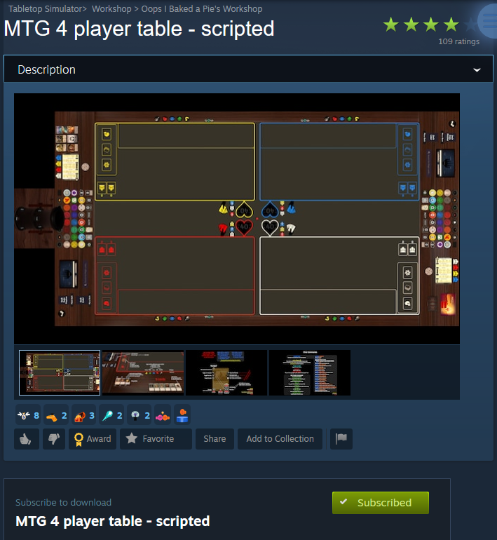
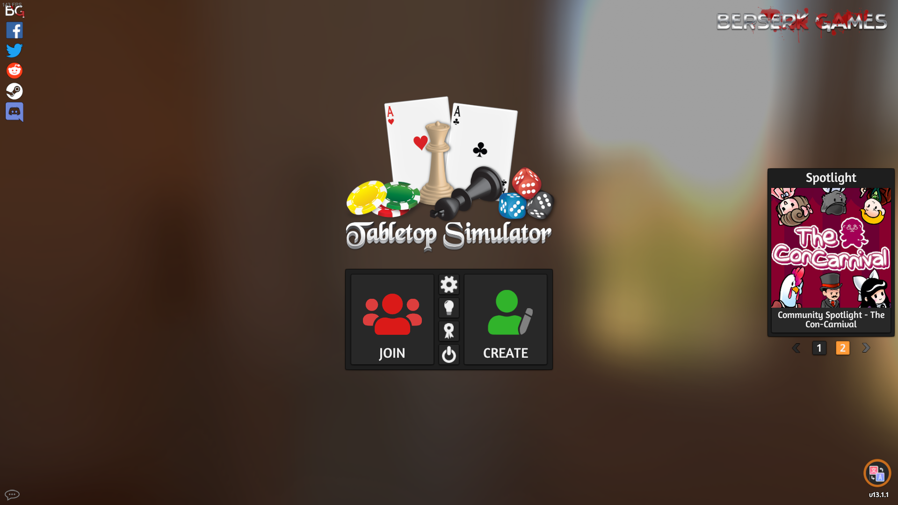
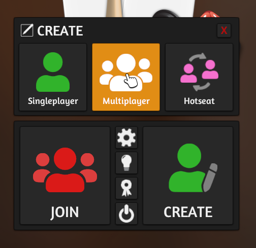
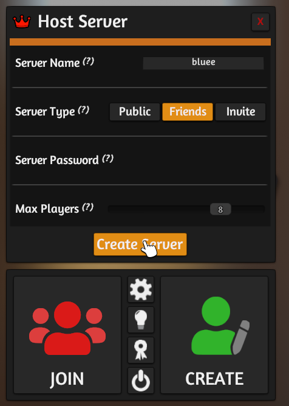
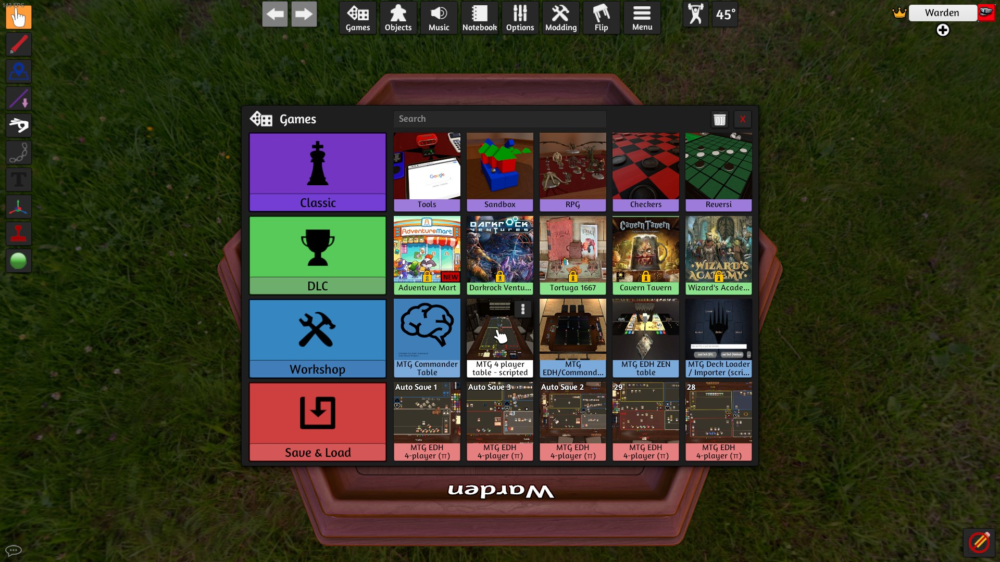
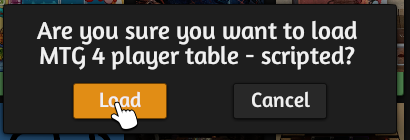

# Playing Magic: The Gathering in Tabletop Simulator

# Prerequisites

You must own and have [Tabletop Simulator](https://store.steampowered.com/app/286160/Tabletop_Simulator/) installed.

## Basic Setup

### Subscribe to an MTG-focused table in the Steam workshop. [example](https://steamcommunity.com/sharedfiles/filedetails/?id=2296042369), [example](https://steamcommunity.com/sharedfiles/filedetails/?id=2246296827)  

### Open Tabletop Simulator

### Play the tutorial

The tutorial is short and gives an introduction to the basics, such as moving decks around, drawing cards, and shuffling.

### Create a lobby
  

### Select the workshop table
  
  
You will need to wait a moment for Tabletop Simulator to load all the assets. Once the percentage counter is gone, it should be good to go.
  
From here, you can pan the camera around in a few ways: hold the middle mouse button and move your mouse, hold the `z` button and move your mouse, or use `WASD`.  
If your camera gets messed up, pressing `space` will reset the camera to your seating position.  
Hitting `p` changes the camera type (which sometimes gets hit accidentally), pressing `p` again will cycle through the types, I recommend 3rd person.

### Load in your deck

You will need to have a link to your deck on a website like tappedout or archidekt, or you will need your decklist copied to your clipboard.

If you have a link, you can grab an "MTG Loader" object out of the infinite bag at corners of the table.  
You can paste in your link, or you can open the notebook tab at the top of the screen and paste your list in the tab for your assigned colour.  
Once your deck is loaded in, you can delete the spawner object with the `delete` or `backspace` keys.  
Move your deck and commander to the appropriate positions, and the tokens can be placed off to the side.

https://user-images.githubusercontent.com/9356891/164586842-2fc10a3e-fce5-4a14-9f98-e887a75006ef.mp4

### Setting up the game

The table comes equipped with a dice that can be used to determine who starts the game.  
The dice will update its faces based on how many players are at the table when you pick it up.

To take your mulligans, the table provides a button to help shuffle your hand in and draw 7 cards.  
Once everyone at the table has indicated that they're keeping their starting hands, whoever won the roll can start the game.

https://user-images.githubusercontent.com/9356891/164588696-ae1d9b3c-2189-4b80-a084-05aab7804809.mp4

### Playing

From here on, continue as if it was paper magic.  
There are a bunch of custom scripted assets to help play the game, but I recommend being in voice chat with the people at the table.  
There are discord servers ([invite](https://discord.gg/CH3Gaefygr)) available to help with matchmaking.

## Tips and Tricks

This section will be more a showcase of features than a direct explanation.  

### Fetching lands

https://user-images.githubusercontent.com/9356891/164590789-fa476903-03f7-47be-9e3a-d27d68050883.mp4

### Making tokens
