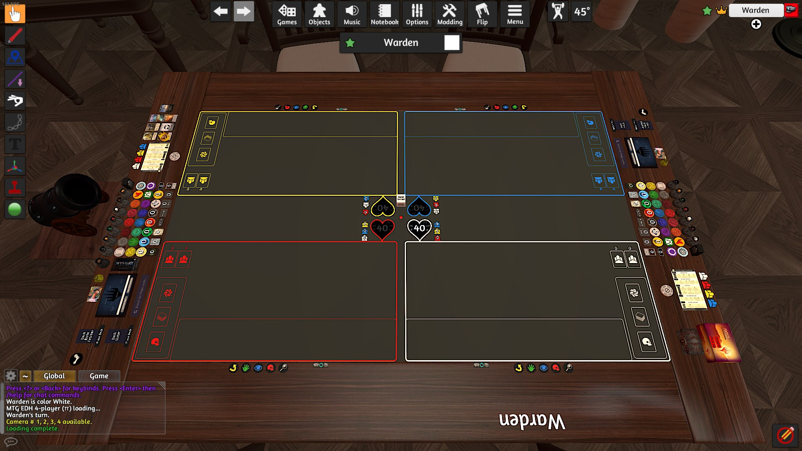

# Playing Magic: The Gathering in Tabletop Simulator

# Prerequisites

You must own and have [Tabletop Simulator](https://store.steampowered.com/app/286160/Tabletop_Simulator/) installed.

## Basic Setup

### Subscribe to an MTG-focused table in the Steam workshop. [example](https://steamcommunity.com/sharedfiles/filedetails/?id=2296042369), [example](https://steamcommunity.com/sharedfiles/filedetails/?id=2246296827)  

### Open Tabletop Simulator

### Create a lobby
  

### Select the workshop table
  
  
You will need to wait a moment for Tabletop Simulator to load all the assets. Once the percentage counter is gone, it should be good to go.
  
From here, you can pan the camera around in a few ways: hold the middle mouse button and move your mouse, hold the `z` button and move your mouse, or use `WASD`.  
If your camera gets messed up, pressing `space` will reset the camera to your seating position.  
Hitting `p` changes the camera type (which sometimes gets hit accidentally), pressing `p` again will cycle through the types, I recommend 3rd person.

### Load in your deck

There are a few ways to load in your deck. You will need to have a link to your deck on a website like tappedout or archidekt, or you will need your decklist copied to your clipboard.

## Matchmaking

## Tips and Tricks