# Minecraft Modding - WORK IN PROGRESS

This will be an opinionated guide on how I write Minecraft mods.

I have been doing this since [2014](https://github.com/TeamDman/Animus/commit/9e717ac074be01d9139b252b2ac5978bc824ca1d) apparently, so I must be doing something right.

## Table of Contents

- [Minecraft Modding - WORK IN PROGRESS](#minecraft-modding---work-in-progress)
  - [Table of Contents](#table-of-contents)
  - [Gathering the tools](#gathering-the-tools)
    - [IDE](#ide)
    - [Java/Software Development Kit (JDK, SDK)](#javasoftware-development-kit-jdk-sdk)
    - [MDK](#mdk)
  - [Creating a repo](#creating-a-repo)
  - [Setting up IntelliJ](#setting-up-intellij)
    - [Opening the project](#opening-the-project)
    - [Switching to the new UI](#switching-to-the-new-ui)
    - [Windows Defender exclusion](#windows-defender-exclusion)
    - [Syncing Gradle](#syncing-gradle)
    - [Changing the JDK](#changing-the-jdk)
    - [Run configurations](#run-configurations)
  - [Switching to Parchment mappings](#switching-to-parchment-mappings)
  - [Hotswapping](#hotswapping)
    - [Troubleshooting](#troubleshooting)
  - [Regarding sidedness](#regarding-sidedness)
  - [Regarding singletons](#regarding-singletons)
  - [Reading Minecraft source code](#reading-minecraft-source-code)
  - [Regarding code from others](#regarding-code-from-others)
  - [Texturing \& Resources](#texturing--resources)
  - [Dev world](#dev-world)
  - [Beyond this tutorial](#beyond-this-tutorial)

## [Gathering the tools](#table-of-contents)

### [IDE](#table-of-contents)

Install the [JetBrains Toolbox App](https://www.jetbrains.com/toolbox-app/).


[Install IntelliJ IDEA](https://www.jetbrains.com/help/idea/installation-guide.html#toolbox);  Community Edition is fine. You can get the Ultimate edition for free if you're [a student](https://www.jetbrains.com/community/education/#students) or if [you do open source stuff](https://www.jetbrains.com/community/opensource/#support). Here's a [comparison](https://www.jetbrains.com/products/compare/?product=idea&product=idea-ce).

### [Java/Software Development Kit (JDK, SDK)](#table-of-contents)

Minecraft currently uses Java 17. You need a Java Software Development Kit (SDK) to write Java code.

JetBrains provides the JetBrains Runtime (JBR) SDK, which has some hot-reloading improvements over other JDKs that are available.

Download the JBRSDK: [direct (windows)](https://cache-redirector.jetbrains.com/intellij-jbr/jbrsdk-17.0.6-windows-x64-b829.9.tar.gz), or go to the [releases](https://github.com/JetBrains/JetBrainsRuntime/releases) page.  
  
[Don't bother with the fastdebug](https://github.com/JetBrains/JetBrainsRuntime/issues/192#issuecomment-1351722143) version, since that's for debugging the JDK itself.  

You can use [7zip](https://www.7-zip.org/) to extract the tar.gz file.

I just extracted it to my downloads folder for now.  


### [MDK](#table-of-contents)

The Mod Development Kit (MDK) can be downloaded from [https://files.minecraftforge.net/](https://files.minecraftforge.net/).

  

Start with the latest version of the game. Learning to port between versions can come later.

Extract the zip file to a folder.

Delete the following files:

- `LICENSE.txt`
- `README.txt`
- `CREDITS.txt`
- `changelog.txt`

I'd recommend reading the `changelog.txt` file when you're actually porting to new versions, but for now we are starting at the newest version.

Here's my folder after removing the mentioned files:  


## [Creating a repo](#table-of-contents)

You should create a [GitHub](https://github.com) repository for your mod.


Git is a tool used to track changes in files on your computer. GitHub is a server where you can upload your Git history so that you aren't screwed when your computer catches fire.

Since this guide is already a Git repository, I will keep the mod we will make in this repository under [./mod/](./mod/).

You should name your git branch the exact version of Minecraft you are targeting. Some people do a branch called `1.19` or `1.19.X`, but it's better to be more specific so when you are porting between `1.19.2` and `1.19.4` you can simply `git checkout` to the version you want. IntelliJ has a great interface for doing `git merge` to transfer changes between branches. 


## [Setting up IntelliJ](#table-of-contents)

### [Opening the project](#table-of-contents)

Open the parent folder in IDEA.

  


When I open the project, this is my initial view:  


### [Switching to the new UI](#table-of-contents)

I'm using the new UI for IntelliJ. To enable it, you can use `Ctrl+Alt+S` to open settings, then on the left under `Appearance & Behavior > New UI` check `Enable new UI`.  


### [Windows Defender exclusion](#table-of-contents)

When we opened the project, IntelliJ told us we can speed up builds by adding an exclusion to Windows Defender

  


Lets pretend attackers won't be able to guess which folders we are excluding.

### [Syncing Gradle](#table-of-contents)

Gradle is the build tool used by Forge. It will do a lot of the work for us.

It probably synched when you opened the project, but hit the reload button just in case.  


You can usually see what task the IDE is working on in the bottom right.  


You can see details on the sync in the Build panel on the bottom left.
  
In this case, we have a bunch of warnings about Minecraft code that is using stuff marked as deprecated. Ignore them.

You can sync the project again and it should be much faster now that all the initial setup is done.  
  
You might notice that this screenshot shows Java 11 being used. Gradle can use Java 11 fine, but for Minecraft we need to use Java 17.

### [Changing the JDK](#table-of-contents)

To change the JDK, open the Project Structure dialog with `Ctrl+Alt+Shift+S`.  


Language level should be set to `17`.  
The SDK should be the JetBrains Runtime we downloaded earlier.  
Click the SDK dropdown.  


Under `Add SDK`, choose `JDK...`.


Find the extracted jbrsdk folder and select it.  
There should be `bin`, `conf`, `lib`, and a few other things inside of it.  


_Someone who follows this guide without having ANY java JDK installed will probably encounter problems in the step before this one when trying to sync gradle. Oh well. I'm not uninstalling every JDK I have to write this guide._

<!-- 
TODO: SDK default language level
TODO: ensure run configurations inherit SDK properly
TODO: parchment mc
 -->

Now you should have the `jbr-17` SDK and the `17` Language level.  
Make sure to hit `OK` or `Apply` to save your changes.  


IntelliJ will probably do a bunch of indexing once switching SDKs. Wait for it to finish. The progress bar is probably in the bottom right.

### [Run configurations](#table-of-contents)

In our fresh project, we can't launch the game yet.


Double click to run the `genIntellijRuns` task, which will create the run configurations for us.  


_Don't use the `runClient` task to launch the game. That will launch the game through Gradle instead of through IDEA._

Even after running this task, you probably won't see the `runClient` run configuration yet.  


To manually refresh, I usually right click the root folder in the project explorer and choose `Reload from Disk`.  
  
I think I manually added the hotkey for this. It's useful for forcing IDEA to recognize changes to files on disk.

There should now be a `runClient` run configuration.  


I basically always `debug` instead of `run`.  
When the game is launched in debug mode, we can pause the game with breakpoints and we can hot-reload code to make changes without having to relaunch.  


Click `Mods` on the main menu.  


You should see the example mod provided with the Forge MDK.  


You can close the game for now.

## [Switching to Parchment mappings](#table-of-contents)

[ParchmentMC](https://parchmentmc.org/docs/getting-started) provides _mappings_ that help make the deobfuscated Minecraft source code less ugly.

In `build.gradle`:  
```diff
plugins {
    id 'eclipse'
    id 'maven-publish'
    id 'net.minecraftforge.gradle' version '5.1.+'
+    // This should be below the net.minecraftforge.gradle plugin
+    id 'org.parchmentmc.librarian.forgegradle' version '1.+'
}
...
minecraft {
...
-    mappings channel: 'official', version: '1.19.4'
+    mappings channel: 'parchment', version: '1.19.3-2023.03.12-1.19.4'
...
}
```

In `settings.gradle`:  
```diff
pluginManagement {
    repositories {
        gradlePluginPortal()
        maven { url = 'https://maven.minecraftforge.net/' }
+        maven { url = 'https://maven.parchmentmc.org' } // Add this line
    }
}
```

Sync Gradle after making the changes.  


---

Here's an example of an IDE-generated method override to demonstrate what ParchmentMC is doing for us. Pay attention to the parameter names. 

Without ParchmentMC:  
```java
    @Override
    public InteractionResult use(
            BlockState p_60503_,
            Level p_60504_,
            BlockPos p_60505_,
            Player p_60506_,
            InteractionHand p_60507_,
            BlockHitResult p_60508_
    ) {
        return super.use(p_60503_, p_60504_, p_60505_, p_60506_, p_60507_, p_60508_);
    }
```

With ParchmentMC:
```java
    @Override
    public InteractionResult use(
            BlockState pState,
            Level pLevel,
            BlockPos pPos,
            Player pPlayer,
            InteractionHand pHand,
            BlockHitResult pHit
    ) {
        return super.use(pState, pLevel, pPos, pPlayer, pHand, pHit);
    }
```

## [Hotswapping](#table-of-contents)

An important part of modding is being able to make changes to your code without having to relaunch the game.

In `ExampleMod.java`, we can switch to using a custom block class for testing hot reloading.

```diff
    // Creates a new Block with the id "examplemod:example_block", combining the namespace and path
-    public static final RegistryObject<Block> EXAMPLE_BLOCK = BLOCKS.register("example_block", () -> new Block(BlockBehaviour.Properties.of(Material.STONE)));
+    public static final RegistryObject<Block> EXAMPLE_BLOCK = BLOCKS.register("example_block", MyBlock::new);
```

Lets also make the logger declared in this file public so we can access it from our new block class

```diff
-    private static final Logger LOGGER = LogUtils.getLogger();
+    public static final Logger LOGGER = LogUtils.getLogger();
```

Finally, lets create `MyBlock.java`:  
```java
package com.example.examplemod;

import net.minecraft.core.BlockPos;
import net.minecraft.world.InteractionHand;
import net.minecraft.world.InteractionResult;
import net.minecraft.world.entity.player.Player;
import net.minecraft.world.level.Level;
import net.minecraft.world.level.block.Block;
import net.minecraft.world.level.block.Blocks;
import net.minecraft.world.level.block.state.BlockBehaviour;
import net.minecraft.world.level.block.state.BlockState;
import net.minecraft.world.level.material.Material;
import net.minecraft.world.phys.BlockHitResult;

public class MyBlock extends Block {
    public MyBlock() {
        super(BlockBehaviour.Properties.of(Material.STONE));
    }
}
```

Lets also install the `Single Hotswap` plugin for IDEA.  
`Ctrl+Alt+S` to open the settings.  
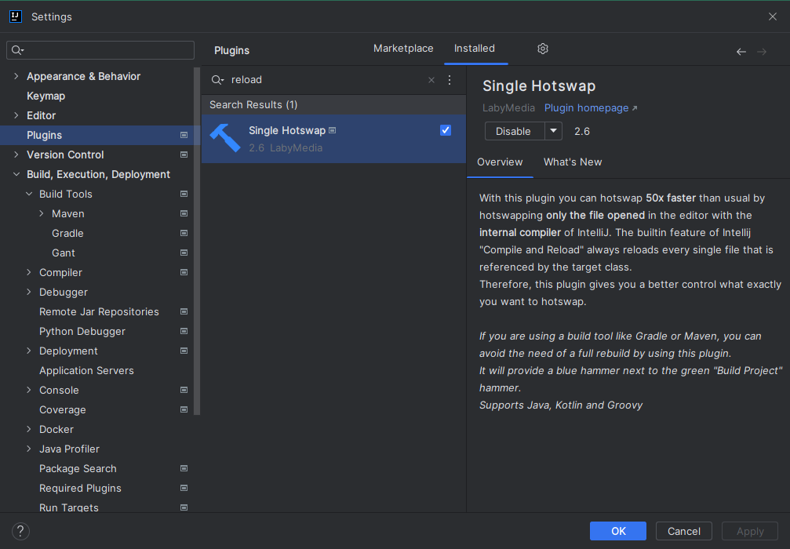

Then lets add the keyboard shortcut for reloading changed classes.  
Personally, I set `Ctrl+Numpad-0` as the binding.  
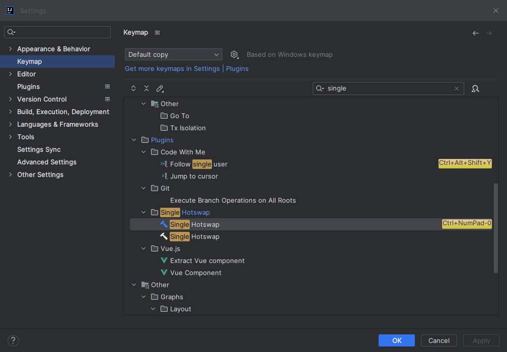

Now launch the game.

Create a new world. You should be able to find the block we added by searching in the creative inventory.  
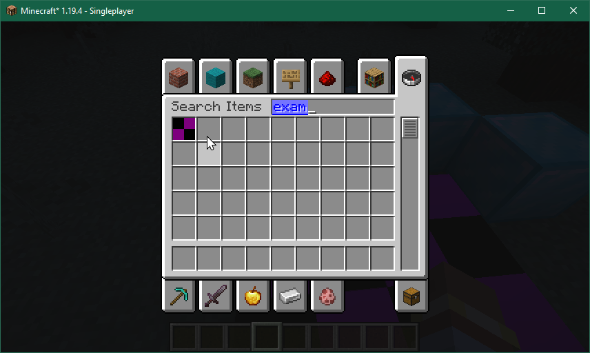

You can place it in the world. It should have no texture at this point.  
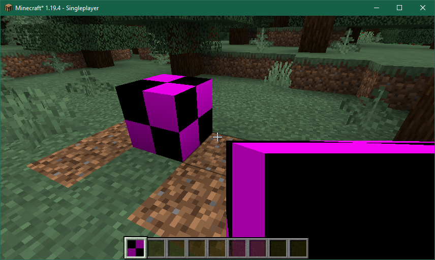

Without closing the game, lets make a change to our block.  
We will override the `use` method, which gets called when our block is right clicked in the world.

You can generate these overrides pretty easily using `Ctrl+O`.  


Minecraft has a bunch of stuff marked with the `@deprecated` annotation, which adds the strikethrough in the override methods picker.

> In some Minecraft classes, there may be methods annotated with @Deprecated. In most situations, the annotation has a special meaning: these methods are fine to override, but these methods should not be directly called, instead preferring a counterpart method in another class.
> 
> For example, methods on the Block class usually have a counterpart in BlockState. It is fine to override a @Deprecated method in Block, but callers should use the corresponding method in BlockState instead.

Here's the change we want to make to `MyBlock.java`:  
```diff
public class MyBlock extends Block {
    public MyBlock() {
        super(BlockBehaviour.Properties.of(Material.STONE));
        ExampleMod.LOGGER.info("MyBlock constructor called");
    }

+    @Override
+    public InteractionResult use(
+            BlockState state,
+            Level level,
+            BlockPos pos,
+            Player player,
+            InteractionHand hand,
+            BlockHitResult hit
+    ) {
+        level.setBlock(pos, Blocks.DIAMOND_BLOCK.defaultBlockState(), Block.UPDATE_ALL);
+        return InteractionResult.CONSUME;
+    }
}
```


Hit the keyboard shortcut we just set.  
You should see a progress bar in the bottom right corner of the IDEA window.  
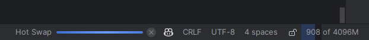

Then it should show a success notification.  
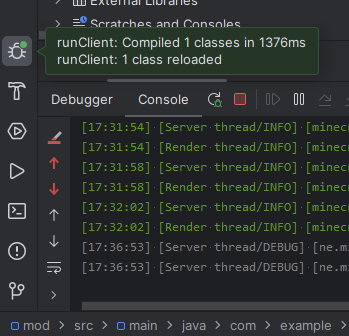

After this change, right clicking the block in the world should replace it with a diamond block.  
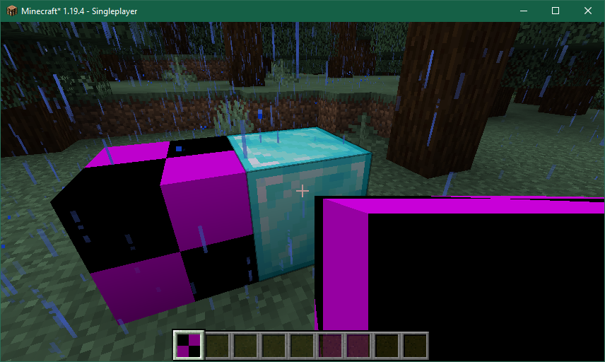

### [Troubleshooting](#table-of-contents)

If you encounter a `Hot Swap failed` message, then your run configuration is probably not using the JBR SDK.
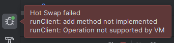

The very first line of the console when running the game should tell you what JDK is being used.

Bad - path to JDK-17:  
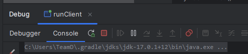

Good - path to JBR SDK:  
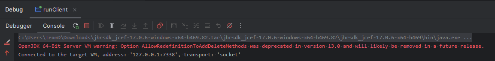

You can double check which JDK the run configs are using by clicking the run config dropdown and hitting `Edit Configurations...`.  
The hotkey shown in this screenshot is one I set myself.    
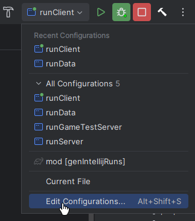

The run configurations should be using the SDK of the `main` module.  
For some reason, it says `java 17` instead of `jbr-17`, but this should still work.  
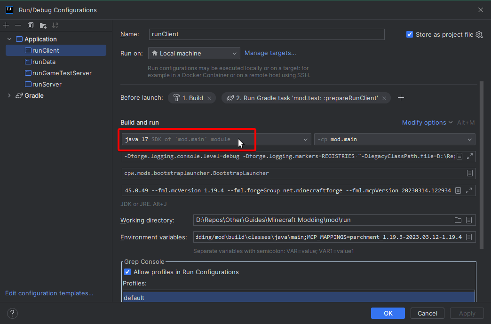

If you remember, we set the Project SDK to `jbr-17` already. (Ctrl+Alt+Shift+S)  


You _could_ manually set the run configuration JDK to be the `jbr-17` instead of having it follow the module SDK, but that change will get overwritten when you run the `genIntellijRuns` Gradle task again.

Instead, you can try `Invalidate Caches and restart...` from the `File` menu.  
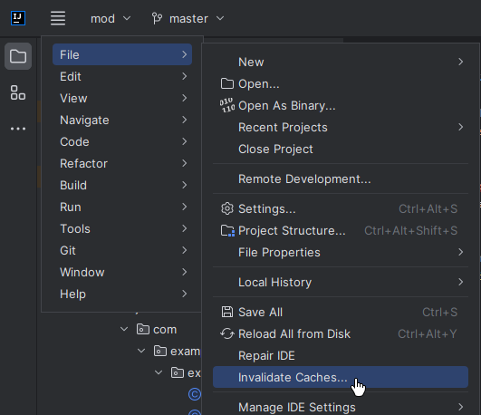  
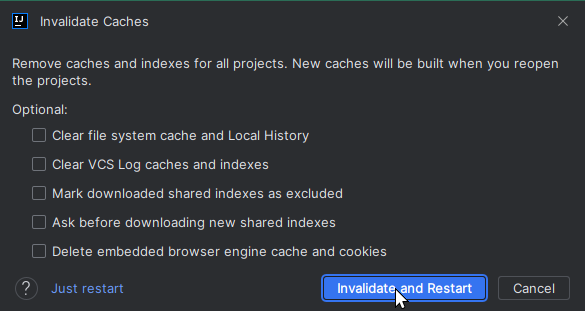

## [Regarding sidedness](#table-of-contents)

You should notice that we pass `Block.UPDATE_ALL` as a parameter to the `setBlock` method.  
This is a bit flag. If you `Ctrl+click` on the code, it should jump to the definition. From there, we can see that `UPDATE_ALL` has the value `3`, which is technically `1 | 2`, which means it will `UPDATE_NEIGHBORS` and `UPDATE_CLIENTS`.

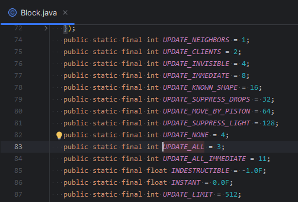

Minecraft has a client and a server. When you are running in single player, you are running both the client and the server on the same machine. It is important to be aware of the sided behaviour, and the order in which things happen.

You can set a breakpoint by clicking in the gutter next to the line number.  
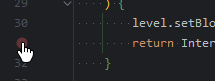

Now right click the block again to trigger the breakpoint.

First, the method is called on the client:  
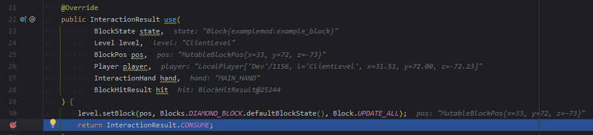

Then on the server:  
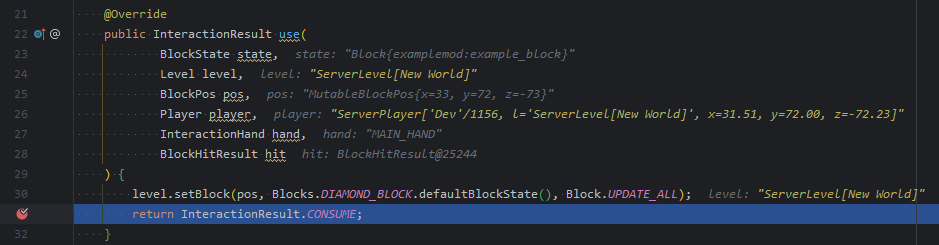

Usually, you want to do things on the server, and if that changes any blocks in the world then the update flags will transmit the changes back to the client.  
```diff
    @Override
    public InteractionResult use(
            BlockState state,
            Level level,
            BlockPos pos,
            Player player,
            InteractionHand hand,
            BlockHitResult hit
    ) {
+        if (level.isClientSide) {
+            return InteractionResult.SUCCESS;
+        }
        level.setBlock(pos, Blocks.DIAMOND_BLOCK.defaultBlockState(), Block.UPDATE_ALL);
-        return InteractionResult.CONSUME;
+        return InteractionResult.SUCCESS; // success seems more appropriate than consume
    }
```

## [Regarding singletons](#table-of-contents)

By now may have noticed that the log statement in the block constructor isn't being called when the block is placed in the world.

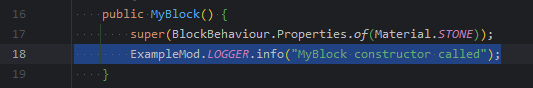

This is because a new instance of your block class isn't created every time your block is placed in the world. Instead, your block class is created some time during registry initialization.

Then that block class has methods with parameters like `BlockPos`, `BlockState` and `Level` that handle the logic for doing stuff with the world.

In `ExampleMod.java`:  
```java
public static final DeferredRegister<Block> BLOCKS = DeferredRegister.create(ForgeRegistries.BLOCKS, MODID);
// Create a Deferred Register to hold Items which will all be registered under the "examplemod" namespace
public static final DeferredRegister<Item> ITEMS = DeferredRegister.create(ForgeRegistries.ITEMS, MODID);

// Creates a new Block with the id "examplemod:example_block", combining the namespace and path
public static final RegistryObject<Block> EXAMPLE_BLOCK = BLOCKS.register("example_block", MyBlock::new);
// Creates a new BlockItem with the id "examplemod:example_block", combining the namespace and path
public static final RegistryObject<Item> EXAMPLE_BLOCK_ITEM = ITEMS.register("example_block", () -> new BlockItem(EXAMPLE_BLOCK.get(), new Item.Properties()));

public ExampleMod()
    {
        IEventBus modEventBus = FMLJavaModLoadingContext.get().getModEventBus();

        // Register the Deferred Register to the mod event bus so blocks get registered
        BLOCKS.register(modEventBus);
        // Register the Deferred Register to the mod event bus so items get registered
        ITEMS.register(modEventBus);
...
```

We create a `DeferredRegister` object.  
Then we call `.register` on it a few times to add some suppliers to it.
Then in the mod constructor, we add the `DeferredRegister` to the mod event bus.  
Then when the game is loading, Forge fires the `RegistryEvent.Register` event, which is handled by the `DeferredRegister` object, which then calls the suppliers it has been given and adds the results to the registry.

What is important about this process is that there is an order in which things are registered.
Through the magic of breakpoints, we can even peek and see what is going on!

Set a breakpoint on the block constructor, then relaunch the game.  
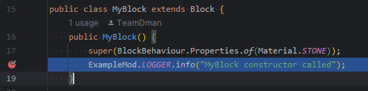

In the call stac, the `postRegisterEvents` method is what we want to look at.  
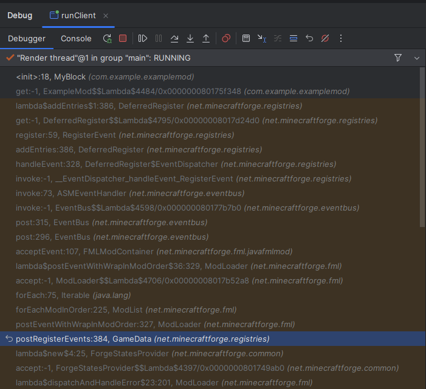

From here, we can see the exact order that the registries are being populated in.  
Notably, registering blocks comes before registering items.  
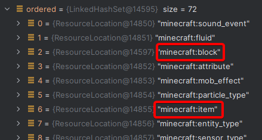

Here's an overview showing the for-loop.  
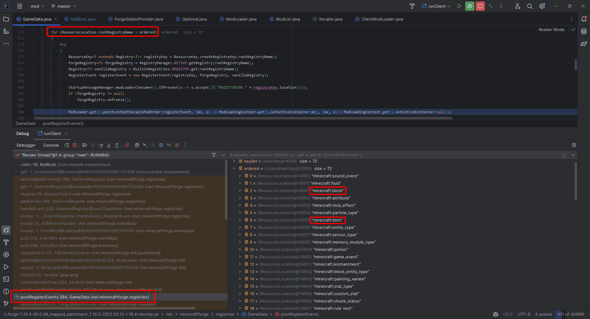

Get good with breakpoints, and be comfortable digging into the source code for Minecraft, Forge, and mods made by others. Chances are you aren't doing something that hasn't been done before, and you can learn a lot by looking at how other people have done things.

## [Reading Minecraft source code](#table-of-contents)

Press shift twice to bring up a search box.  
You might have to hit shift twice _again_ to turn on `Include non-project items`.

From here, you can find and open the class files for Vanilla stuff for you to learn from.  Just look at the closest Minecraft equivalent for whatever features you want.

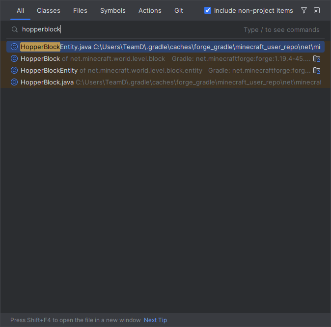

## [Regarding code from others](#table-of-contents)

Learning is great, but make sure you aren't copying code willy-nilly. Software licenses are a thing, and you should be aware of them. You should explicitly assign one to your project, and you should make sure you respect the licenses of other people's projects.

I recommend the Mozilla Public License 2.0. [tl;dr](https://www.tldrlegal.com/license/mozilla-public-license-2-0-mpl-2), [101](https://fossa.com/blog/open-source-software-licenses-101-mozilla-public-license-2-0/), [faq](https://www.mozilla.org/en-US/MPL/2.0/FAQ/)  
It strikes a good balance between forcing people to share their changes, and allowing people to use your code in their own projects.  
Having your mod available under an open source license means that people can learn and benefit from your code, and if you die/get tired of updating your shit, then someone will have an easier time getting your mod (or something inspired by it) working on newer versions of the game.

https://choosealicense.com/ is a good place to start if you want to pick one according to your own desires.

## [Texturing & Resources](#table-of-contents)

The block has no texture. The name is not proper.  
This is fixed by creating the necessary JSON files.

Instead of creating these JSON files by hand, we can use [datagens](https://docs.minecraftforge.net/en/1.19.2/datagen/) to create them for us.  


## [Dev world](#table-of-contents)

Some cheat commands I find helpful:

```
/gamerule doDaylightCycle false
/time set day
/gamerule doWeatherCycle false
/weather clear
/gamerule doMobSpawning false
/difficulty peaceful
/kill @e[type=!minecraft:player]
```

<!-- 
Alternatively, the [tool-kit](https://www.curseforge.com/minecraft/mc-mods/tool-kit/files/3933949) mod has a command to do most of this:

```
/tk devenv true
``` -->

## [Beyond this tutorial](#table-of-contents)

Here's some things you can do to learn more:

- [Read the official Forge docs](https://docs.minecraftforge.net/en/1.19.2/)
- [ChatGPT knows about Minecraft modding, might be slightly outdated but still very helpful](https://chat.openai.com/)
- [Watch some tutorials. This person has some decent videos](https://www.youtube.com/@ModdingByKaupenjoe)
- Look at some of my recent WIP mods
  - https://github.com/TeamDman/SuperFactoryManager/tree/1.19.4
  - https://github.com/TeamDman/Dyelicious
- [Join the official Forge discord](https://discord.minecraftforge.net/)
  - https://dontasktoask.com/
  - Use the search to see if someone has resolved a similar issue to yours already