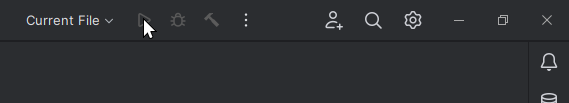

# Minecraft Modding

This will be an opinionated guide on how I write Minecraft mods.

I have been doing this since [2014](https://github.com/TeamDman/Animus/commit/9e717ac074be01d9139b252b2ac5978bc824ca1d) apparently, so I must be doing something right.

## Table of Contents

- [Minecraft Modding](#minecraft-modding)
  - [Table of Contents](#table-of-contents)
  - [Gathering the tools](#gathering-the-tools)
    - [IDE](#ide)
    - [JDK](#jdk)
    - [MDK](#mdk)
  - [Creating a repo](#creating-a-repo)
  - [Setting up IntelliJ](#setting-up-intellij)
    - [Opening the project](#opening-the-project)
    - [Switching to the new UI](#switching-to-the-new-ui)
    - [Windows Defender exclusion](#windows-defender-exclusion)
    - [Syncing Gradle](#syncing-gradle)
    - [Changing the JDK](#changing-the-jdk)
    - [Run configurations](#run-configurations)
  - [Creating a dev world](#creating-a-dev-world)
  - [Some links](#some-links)

## [Gathering the tools](#table-of-contents)

### [IDE](#table-of-contents)

Install the [JetBrains Toolbox App](https://www.jetbrains.com/toolbox-app/).


[Install IntelliJ IDEA](https://www.jetbrains.com/help/idea/installation-guide.html#toolbox);  Community Edition is fine. You can get the Ultimate edition for free if you're [a student](https://www.jetbrains.com/community/education/#students) or if [you do open source stuff](https://www.jetbrains.com/community/opensource/#support). Here's a [comparison](https://www.jetbrains.com/products/compare/?product=idea&product=idea-ce).

### [JDK](#table-of-contents)

Minecraft currently uses Java 17. You need a Java Software Development Kit (SDK) to write Java code.

JetBrains provides the JetBrains Runtime (JBR) SDK, which has some hot-reloading improvements over other JDKs that are available.

Download the JBRSDK: [direct (windows)](https://cache-redirector.jetbrains.com/intellij-jbr/jbrsdk-17.0.6-windows-x64-b829.9.tar.gz), or go to the [releases](https://github.com/JetBrains/JetBrainsRuntime/releases) page.  
  
[Don't bother with the fastdebug](https://github.com/JetBrains/JetBrainsRuntime/issues/192#issuecomment-1351722143) version, since that's for debugging the JDK itself.  

You can use [7zip](https://www.7-zip.org/) to extract the tar.gz file.

I just extracted it to my downloads folder for now.  


### [MDK](#table-of-contents)

The Mod Development Kit (MDK) can be downloaded from [https://files.minecraftforge.net/](https://files.minecraftforge.net/).

  

Start with the latest version of the game. Learning to port between versions can come later.

Extract the zip file to a folder.

Delete the following files:

- `LICENSE.txt`
- `README.txt`
- `CREDITS.txt`
- `changelog.txt`

I'd recommend reading the `changelog.txt` file when you're actually porting to new versions, but for now we are starting at the newest version.

Here's my folder after removing the mentioned files:  


## [Creating a repo](#table-of-contents)

You should create a [GitHub](https://github.com) repository for your mod.


Git is a tool used to track changes in files on your computer. GitHub is a server where you can upload your Git history so that you aren't screwed when your computer catches fire.

Since this guide is already a Git repository, I will keep the mod we will make in this repository under [./mod/](./mod/).

You should name your git branch the exact version of Minecraft you are targeting. Some people do a branch called `1.19` or `1.19.X`, but it's better to be more specific so when you are porting between `1.19.2` and `1.19.4` you can simply `git checkout` to the version you want. IntelliJ has a great interface for doing `git merge` to transfer changes between branches. 


## [Setting up IntelliJ](#table-of-contents)

### [Opening the project](#table-of-contents)

Open the parent folder in IDEA.

  


When I open the project, this is my initial view:  


### [Switching to the new UI](#table-of-contents)

I'm using the new UI for IntelliJ. To enable it, you can use `Ctrl+Alt+S` to open settings, then on the left under `Appearance & Behavior > New UI` check `Enable new UI`.  


### [Windows Defender exclusion](#table-of-contents)

When we opened the project, IntelliJ told us we can speed up builds by adding an exclusion to Windows Defender

  


Lets pretend attackers won't be able to guess which folders we are excluding.

### [Syncing Gradle](#table-of-contents)

Gradle is the build tool used by Forge. It will do a lot of the work for us.

It probably synched when you opened the project, but hit the reload button just in case.  


You can usually see what task the IDE is working on in the bottom right.  


You can see details on the sync in the Build panel on the bottom left.
  
In this case, we have a bunch of warnings about Minecraft code that is using stuff marked as deprecated.  
Minecraft has a bunch of stuff marked `@deprecated`.  
> In some Minecraft classes, there may be methods annotated with @Deprecated. In most situations, the annotation has a special meaning: these methods are fine to override, but these methods should not be directly called, instead preferring a counterpart method in another class.
> 
> For example, methods on the Block class usually have a counterpart in BlockState. It is fine to override a @Deprecated method in Block, but callers should use the corresponding method in BlockState instead.

You can sync the project again and it should be much faster now that all the initial setup is done.  
  
You might notice that this screenshot shows Java 11 being used. Gradle can use Java 11 fine, but for Minecraft we need to use Java 17.

### [Changing the JDK](#table-of-contents)

To change the JDK, open the Project Structure dialog with `Ctrl+Alt+Shift+S`.  


Language level should be set to `17`.  
The SDK should be the JetBrains Runtime we downloaded earlier.  
Click the SDK dropdown.  


Under `Add SDK`, choose `JDK...`.


Find the extracted jbrsdk folder and select it.  
There should be `bin`, `conf`, `lib`, and a few other things inside of it.  


_Someone who follows this guide without having ANY java JDK installed will probably encounter problems in the step before this one when trying to sync gradle. Oh well. I'm not uninstalling every JDK I have to write this guide._

<!-- 
TODO: SDK default language level
TODO: ensure run configurations inherit SDK properly
TODO: parchment mc
 -->

Now you should have the `jbr-17` SDK and the `17` Language level.  
Make sure to hit `OK` or `Apply` to save your changes.  


IntelliJ will probably do a bunch of indexing once switching SDKs. Wait for it to finish. The progress bar is probably in the bottom right.

### [Run configurations](#table-of-contents)

In our fresh project, we can't launch the game yet.



Double click to run the `genIntellijRuns` task, which will create the run configurations for us.  


_Don't use the `runClient` task to launch the game. That will launch the game through Gradle instead of through IDEA._

Even after running this task, you probably won't see the `runClient` run configuration yet.  


To manually refresh, I usually right click the root folder in the project explorer and choose `Reload from Disk`.  
  
I think I manually added the hotkey for this. It's useful for forcing IDEA to recognize changes to files on disk.

There should now be a `runClient` run configuration.  


I basically always `debug` instead of `run`.  
When the game is launched in debug mode, we can pause the game with breakpoints and we can hot-reload code to make changes without having to relaunch.  


Click `Mods` on the main menu.  


You should see the example mod provided with the Forge MDK.  


## [Creating a dev world](#table-of-contents)

I usually create a superflat world with cheats enabled.

Some commands I find helpful:

```
/gamerule doDaylightCycle false
/time set day
/gamerule doWeatherCycle false
/weather clear
/gamerule doMobSpawning false
/difficulty peaceful
/kill @e[type=!minecraft:player]
```

<!-- 
Alternatively, the [tool-kit](https://www.curseforge.com/minecraft/mc-mods/tool-kit/files/3933949) mod has a command to do most of this:

```
/tk devenv true
``` -->

## [Some links](#table-of-contents)


https://docs.minecraftforge.net/en/1.19.2/

https://www.youtube.com/@ModdingByKaupenjoe
